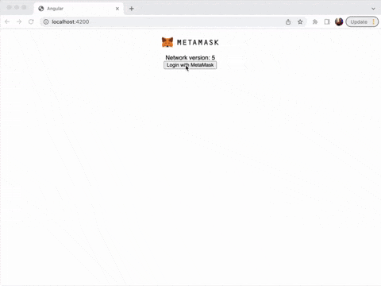

# metamask-angular-app

## Local setup guide
After cloning the repo, install the application and start Angular:
```
cd metamask-angular-app
npm install
ng serve
```

## Demo



## Deployment on BTP
- Clone repo
- Go to **metamask-angular-app**
```
cd metamask-angular-app
```
- Build **metamask-angular-app**
```
ng build
cp cf/* dist
```
- Login to BTP
```
cf api https://api.cf.eu20.hana.ondemand.com
cf login --sso
```
- Select your target organisation and space
```
Select an org:
1. dbs-cx-services_cx-boosters-41n7uah4

Org (enter to skip): 1
Targeted org dbs-cx-services_cx-boosters-41n7uah4.

Targeted space dev.

API endpoint:   https://api.cf.eu20.hana.ondemand.com
API version:    3.124.0
user:           yannick.robin@sap.com
org:            dbs-cx-services_cx-boosters-41n7uah4
space:          dev
```
- Push the application (this will create the route, deploy and start the application)
```
cf push
```
- Wait for **metamask-angular-app** to start
```
